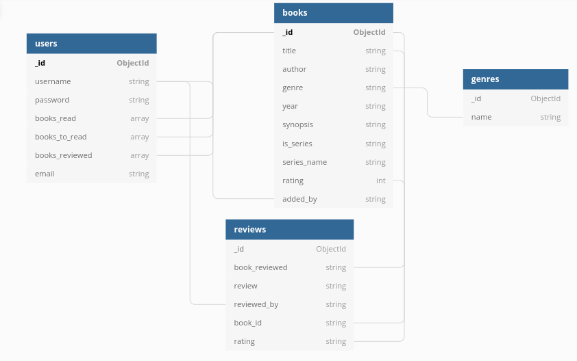

# Book Club

As part of my full-stack software development diploma, I have created an application utilising database storage. The focus has been on the back-end programming, allowing users to store and manipulate data via the frontend.  
 
This is a book review app on which users can create an account, add books, review books and save a list of books they have read and that they want to read. 

# Contents

- [User Experience](#user-experience)
    - [Strategy](#strategy)
    - [User Stories](#user-stories)
    - [Design](#design)
    - [Features](#features)
- [Technologies](#technologies)
    - [Languages](#languages)
    - [Libraries, Frameworks and programs](#libraries-frameworks-and-programs)
- [Testing](#testing)
- [Bugs and Fixes](#bugs-and-fixes)
- [Deployment](#deployment)
- [Credits](#credits)

# User Experience

## Strategy
### User goals
- Review books they have read
- Find their next book based off description and reviews

### Site owner goals
- Have an intuitive site
- Have the site look clean and unmuddled
- Build a media presence to increase the nember of user to increase the range of books and reviews.

## User Stories
### First time users
1. As a user I want to know what the app is for
2.  As a user I want to be able to make an account
    
### Registired Users
3. As a registired user I want to be able to write reviews
4. As a registired user I want to be able to edit my reviews
5. As a registired user I want to be able to delete my reviews
6. As a registired user I want to be able to Add books
7. As a registired user I want to be able to vote books up or down

## Design
### Color scheme and imagery

At first I simply wantd a clean and light design, but as it developed I wanted it to feel remenicent of a classic study, or warm cluttered library; Deep browns and green, with imagry of books. The layout was to be functional and professional, whilst still maintaining a warm and cosy feel. 

### Typography

Fitting with the 'classic' astetic, I chose two main fonts: 
    
    

### Wireframes

Althought the final product differs from these first designs, the layout and pages are mostly the same.
[link to wireframs](docs/README-imgs/wireframes)

### Database

The database was designed on [dbdiagram](https://dbdiagram.io/home) and outlines the relationship between different documents within.

## Features
- ## Nav bar

    **All pages have the same nav bar located at the top of the screen.**
        
        - The 'Book Club' link is located at the top left, this takes the user to the home page.
        
    *If the user is not logged in:*

        - A 'log in' link is located at top right. This takes the user to a log in page.

        - A 'sign up' link is located at the top right. This takes the user to a sign up page.

    *If the user is logged in:*

        - A 'Search Books' link is located at the rop right. This takes the user to the home page.

        - A 'My Library' link is located at the top right. This takes the user to a page where they can view books they have saved.

        - A 'My Reviews' link is located at the top right. This takes the user to a page where they can view the reviews they have left.

        - A 'My Profile' link is located at the top right. This takes the user to a page where they can access their books, reviews as well as links to add books and edit their account details.

        - A 'Log out' link is located at the top right. This logs the user out and takes them to the log in page.

    **On screens with a max-width of 600px, the 'Book Club' link is top center and there is a drop down nav bar located at the top left of the screen with all the same links as the larger screens.**

- ## Home page

    **This is where the user can search all the books in the database.**

    *If the user is not logged in:*

        - There is a flashing call to action in the center of the screen which takes the user to the sign up page.

        - Below the CTA there is a search bar which takes an input.

        - A 'Reset' button sits below the search bar and reloads the home page, clearing any searches.

        - A 'Search' button sits below the search bar and reloads the home page with books based on the search input.

        - A section containing a list of the books in the database is below the search bar and buttons. Each 'book' can be clicked on, revealing more information, about the book as well as reviews linked to the book.

    *If the user is logged in:*

        - Above the list of books is an 'Add Book' button. This takes the user to a page to add a book tot he databse.

        - Below each book, after it has been clicked, is an 'Add to Library' button. This takes the user to a page where they can chose to add the selected book to one of two lists in their library.

        - If the book has been added by the user, there is an 'Edit book' button which takes them to a page to edit that book.

        - Above the reviews for each book, if the user has not reviewed it yet, there is a 'Review' button. This takes the user to a page where they can review the book.

        - Below any reviews the user has posted, there is an 'Edit Review' button. This takes the user to a page where they can edit their review.

        - Below any reviews the user has posted, there is a 'Delete Review' button. This takes the user to a page where they can delete their review.

- ## Sign up

        - 'Email' input field

        - 'User Name' input field

        - 'Password' input field

        - 'Confirm Password' input field

        - A 'Register' button which adds the users information to the database and takes the user to the 'Log in' page

        - A worded link which takes the user to the 'Log in' page

- ## Log in

        - 'User Name' input field

        - 'Password' input field

        - 'Log In' Button which logs the user in and takes them to the 'My Profile' page.

        - A worded link which takes the user to the 'Sign up' page

- ## My Profile

    **Each users profile page has several icons which link to their respective pages**

        - 'Search books' (This links to the home page)
        - 'Add Book'
        - 'My Reviews'
        - 'My Lubrary'
        - 'Edit Account' 

- ## Add Book

    **There is a form which takes up to seven user inputs.**

        - Title: Alpha/Numeric
        - Genre: Drop down selection
        - Author: Alpha/Numeric
        - Year of Publishing: Numeric, 4 digits
        - Synopsis: Alpha/Numeric
        - Is This A Series: Toggle button (optional)
        - Name of Series: Alpha/numeric (optional)

        - An 'Add Book' Button. This adds the book to the database and takes the user to a page so they can review the book.

- ## Review Book

    **This page features the name and synopsis of the book to be reviewed.**

        - A 'Review' input field
        - A 'Rating' section with 5 clickable stars.
        - A 'Review' Button which adds the review to the database and returns the user to the home page.

- ## My Library

    **There are two main sections which resemble the books section from the home page, minus the reviews section and related buttons.**

        - Each book in the 'Books I've Read' and 'Books to Read' sections has a "Remove" button which will remove the book from the users profile.

        - Each book in the 'Books to Read' section has an additional 'Add to Books Read' button, which adds the book to the 'Books I've Read' section and removes the book from the 'Books to Read' section.

- ## My Reviews

    **There is one main section with a list. Each item contains the name of the book reviewed, author and the rating given. Upon clicking each item the review is shown.**

        - An 'Edit' button takes the user to an 'edit review' page.

        - a 'Delete' button takes the user to a 'Confirm review delete' page

- ## Edit Review

    **This page is the same as the 'Review Book' page, with the users review already filled out, ready to be edited.**

        - an 'Edit' button will update the review and take the user to 'My Reviews' page.

- ## Confirm Review Delete

    **This page has the review the user is trying to delete shown**

        - A 'Delete' button, which removes the reviews from the database and takes the user to the home page.

        - A 'Cancel' button, which takes the user back to the home page.

- ## Edit Account

    **This page has two forms; one for email and username update and one for password update.**

        - 'Email' input
        - 'Username' input
        - 'Edit' button which updates the database with the new username and/or email address, logs the user out, and takes them to the log in page.

        - 'Current Password' input
        - 'New Password' input
        - 'Confirm New Password' input
        - 'Edit Password' button which updates the database with the new password, logs the user out and takes them to the log in page. 

- ## Footer

    **Each page has the same footer, which contains three social media links at the bottom right:**

        - Instagram
        - Facebook
        - Twitter
    **Each one will open its respective social media page in a new tab.**

- ## future features

    - A 'contact us' page 
    - Pagination 
    - Links to allow bookshop purchaces via the app
    - Links to single pages for each book with more information and links to similar books

# Technologies

## Languages
- #### HTML5: 
    >HTML5 is a markup language used for structuring and presenting content on the World Wide Web. It is the fifth and last major HTML version that is a World Wide Web Consortium (W3C) recommendation. [Read more..](https://en.wikipedia.org/wiki/HTML5)

    This was used to create all the pages on the front end.

- #### CSS3:
    >Cascading Style Sheets (CSS) is a style sheet language used for describing the presentation of a document written in a markup language such as HTML. [Read more..](https://en.wikipedia.org/wiki/CSS#CSS_3)

    This was used to create custom styles for the HTML pages, as well as suppliment some of the frameworks used.

- #### Python:
    >Python is an interpreted high-level general-purpose programming language. Its design philosophy emphasizes code readability with its use of significant indentation. Its language constructs as well as its object-oriented approach aim to help programmers write clear, logical code for small and large-scale projects. [Read more..](https://en.wikipedia.org/wiki/Python)

    This was used to create the majority of logic in the application and is responsible for communicating between the database and the webpage. 

## Libraries, Frameworks and programs
- #### GitHub:
    >GitHub, Inc. is a provider of Internet hosting for software development and version control using Git. It offers the distributed version control and source code management (SCM) functionality of Git, plus its own features. It provides access control and several collaboration features such as bug tracking, feature requests, task management, continuous integration and wikis for every project. [Read more..](https://en.wikipedia.org/wiki/GitHub)

    This was used for version control, all stages of the project are documented on my github account.

- #### GitPod:
    >Gitpod is a container-based development platform that puts developer experience first. Gitpod provisions ready-to-code developer environments in the cloud accessible through your browser (on your computer or tablet) and your local IDE. [Read more..](https://www.gitpod.io/docs)

    This was used as the development enviroment for the entire project.

- #### FontAwesome:
    >Font Awesome is a font and icon toolkit based on CSS and Less. [Read more..](https://en.wikipedia.org/wiki/Font_Awesome)

    This was used for a number of icons throughout the app, to increase the UX and intuitivness.

- #### Materialise:
    >Created and designed by Google, Material Design is a design language that combines the classic principles of successful design along with innovation and technology. [Read more..](https://materializecss.com/about.html)

    This was used as a mix of HTML, CSS and JavaScript for a lot of the features on the app, including; colors, buttons, collapsibles, nav bars and form elements. 

- #### Flask:
    >Flask is a micro web framework written in Python. It is classified as a microframework because it does not require particular tools or libraries.[2] It has no database abstraction layer, form validation, or any other components where pre-existing third-party libraries provide common functions. However, Flask supports extensions that can add application features as if they were implemented in Flask itself. [Read more..](https://en.wikipedia.org/wiki/Flask_(web_framework))

    This was used for the creation of the app itself.

- #### MongoDB:
    >MongoDB is a source-available cross-platform document-oriented database program. Classified as a NoSQL database program, MongoDB uses JSON-like documents with optional schemas. [Read more..](https://en.wikipedia.org/wiki/MongoDB)

    This was used as the main database for the app.

- #### Werkzeug:
    >Werkzeug is a comprehensive WSGI web application library. It began as a simple collection of various utilities for WSGI applications and has become one of the most advanced WSGI utility libraries. [Read more..](https://werkzeug.palletsprojects.com/en/2.0.x/)

    This was used to create secure passwords for users accounts.

- #### Heruko:
    >Heroku is a cloud platform as a service (PaaS) supporting several programming languages. One of the first cloud platforms, Heroku has been in development since June 2007, when it supported only the Ruby programming language, but now supports Java, Node.js, Scala, Clojure, Python, PHP, and Go. [Read more..](https://en.wikipedia.org/wiki/Heroku)

    This was used to host the app.

- #### JQuery:
    >jQuery is a JavaScript library designed to simplify HTML DOM tree traversal and manipulation, as well as event handling, CSS animation, and Ajax. [Read more..](https://en.wikipedia.org/wiki/JQuery)

    This was used in conjuncture with some of the materialize components.

- #### RandomKeyGen:
    >Our free mobile-friendly tool offers a variety of randomly generated keys and passwords you can use to secure any application, service or device. [Read more..](https://randomkeygen.com/)

    This was used to create secure codes for the app

- #### Jinja:
    >Jinja is a fast, expressive, extensible templating engine. Special placeholders in the template allow writing code similar to Python syntax. Then the template is passed data to render the final document.[Read more..](https://jinja.palletsprojects.com/en/3.0.x/)

    This was used to add logic to the HTML and dynamically populate each page with the appropriate data from the database. 

- #### AmIResponsive:
    A tool to quickly show how your site or app will look across different devices.[Link to site](http://ami.responsivedesign.is/)

# Testing

# Bugs and Fixes
# Deployment
# Credits

- Code

    stars - https://bennettfeely.com/

    star rating - BananaCoding https://www.youtube.com/watch?v=8qCJahxZ9nQ

- Images

    stack of books with whole in middle - https://www.wallpaperflare.com/stacked-of-assorted-title-book-forming-round-hole-in-the-middle-wallpaper-170972

    writing desk - https://www.vimercatimeda.com/en/writing%20table-louis-xv-style-extensible-shelves

    large selection of books - https://www.inyourarea.co.uk/news/cosy-libraries-in-london-with-a-large-selection-of-books/

    cosy library - https://www.culturesouthwest.org.uk/home-design/create-a-cosy-home-library/

    classic study - https://www.pinterest.co.uk/pin/368310075752357476/

- data

    data-structure - https://dbdiagram.io/d/61829c08d5d522682df704ce