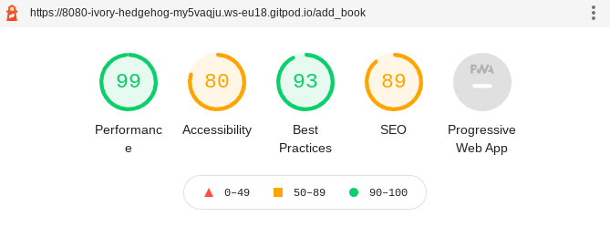

# Testing

Testing was done throughout the project via chrome development tools. I also used various code validators to make sure my code was free of errors.

## Contents

- [Validators](#validators)
    - [WC3](#wc3)
    - [PEP8](#pep8)
    - [JSHint](#jshint)
    - [Lighthouse](lighthouse)
- [User Stories](#user-stories)

## Validators

- ### [WC3](https://validator.w3.org/nu/)

    - ### books.html
    
    - ### my_library.html
    
    - ### add_book.html
    
    - ### confirm_review_delete.html
    
    - ### edit_account.html
    
    - ### edit_book.html
    
    - ### edit_review.html
    
    - ### log_in.html
    
    - ### my_reviews.html
    
    - ### review_book.html
    
    - ### sign_up.html
    
    - ### user_profile.html
    
    - ### style.css
    

- ### [PEP8 Online](http://pep8online.com/)

    - ### app.py
    

- ### [JSHint]()

    - ### script.js
    

## Lighthouse

- ### add_book.html desktop

- ### add_book.html mobile

- ### add_genre.html desktop

- ### add_genre.html mobile

- ### books.html desktop

- ### books.html desktop

- ### confirm_review_delete.html desktop

- ### confirm_review_delete.html mobile

- ### edit_account.html desktop

- ### edit_account.html mobile

- ### edit_genre.html desktop

- ### edit_genre.html mobile

- ### edit_review.html desktop

- ### edit_review.html mobile

- ### my_library.html desktop

- ### my_library.html mobile

- ### my_reviews.html desktop

- ### my_reviews.html mobile

- ### remove_user.html deskptop

- ### remove_user.html mobile

- ### review_book.html desktop

- ### review_book.html desktop

- ### user_profile.html desktop

- ### user_profile.html mobile

## User stories

1. As a user I want to know what the app is for

2. As a user I want to be able to make an account
    

3. As a registired user I want to be able to write reviews

4. As a registired user I want to be able to edit my reviews

5. As a registired user I want to be able to delete my reviews

6. As a registired user I want to be able to Add books

